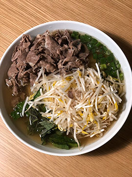
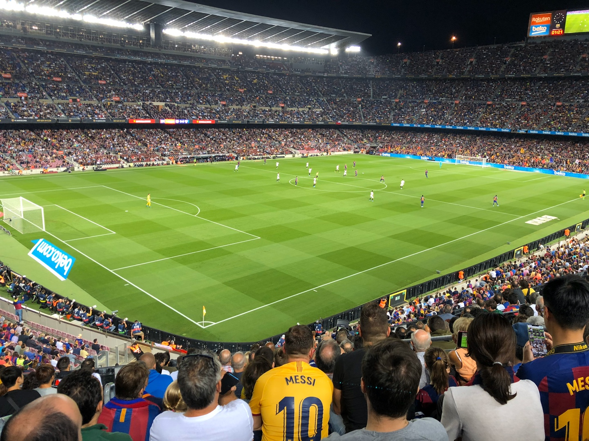

올해 3년 조금 넘게 다녔던 회사를 나오면서 막연하게 블로그를 시작해야겠다는 생각을 했는데, 기록을 거울 삼아 배우고 싶었다. 메모장에 이것저것 끄적인건 많은데 여유가 된다면 하나씩 풀고 싶다.

마침 2020년이다, 2019 회고를 핑계 삼아 시작하면 되겠다.

---

## 작년 타임라인

작년엔 무엇을 했나? 사진첩을 보면서 계절마다 중요하다고 생각하는 타임라인을 정리해보았다.

1. **봄🌱- 이사📦**

작년 초 독립을 하면서 많은 경험을 했다. 인테리어에도 관심이 생기고 요리에 관심도 생겨서 한 동안 인스타그램 '홈 계정'을 만들어서 운영하다가 지금은 게시물을 다 지웠다. 

목적이 있어서 만든 계정이 아니어서 그런지 개인적인 한계를 느꼈다.

독립의 가장 좋은 점은 나만의 공간이 생긴다는 것이다. 각종 집안일도 생기고 생활 비용 등, 챙겨야할 것도 많지만 아직까지는 나의 성향과 잘 맞는 것 같다.

2. **여름⛱️- 여행✈️**

사진첩을 훑어보니 오키나와, 스페인, 제주도, 베트남, 캠핑 등 여행을 많이 다녔었다.

사진만 보아도 마음이 차는 것 같다. 내년에는 해외 컨퍼런스를 가보고 싶은 마음이 있기 때문에 미국에 가보고 싶다.

3. **가을🍂- 이모티콘😉**

처음엔 장난으로 짤로 만들어 시작했던게 점점 커져서 이모티콘으로 만들게 되었다. 

출시 이후, 카카오 이모티콘 10위권안에 들었을때는 나보다 훨씬 잘버는 이 녀석을 보면서 뿌듯해하기도 했다. 그리고 1위의 하루 매출도 궁금해졌었다.

이런 재밌는 경험 때문에 한동안 디지털 컨텐츠라는 것에 관심이 생겼었다. 능력만 되면 웹툰도 만들어보고 싶고 음악, 영화도 제작해보고 싶다.

틈새 홍보.. [https://e.kakao.com/t/my-mom-myongsuk](https://e.kakao.com/t/my-mom-myongsuk)

4. **겨울☃️- 퇴사👋**

뭐랄까.. 조금은 지친 상태에서 우연하게 마주했다.

커리어에 있어서 수준급 개발자 라는 타이틀도 좋을테지만 그보다 내가 만족할 수 있는 좋은 서비스를 만들 정도로만 공부하고 싶었다.

이번 계기로 내가 원하는 것과 나의 가치에 대해 조금이라도 힌트를 얻을 수만 있으면 더 바랄게 없겠다.

끝으로.. 

계절 타임라인으로만 보았을때는 전년도(2018)에 계획한 것이 거의 없었다. 심지어 퇴사 조차도 예상하지 못한 일이다. 즉흥적으로 결정하는 것도 좋지만 앞으로 조금은 계획을 실천해보는 것도 좋은 경험이 되지 않을까 생각이 든다.

---

## 내년 타임라인

- [ ] 이직한 곳에서 좋은 서비스를 만들고, 좋은 팀원이 되고 싶다.
- 운동 꾸준히 다니기, 이제는 빼박 30대가 되어서 관리를 해야 할 것 같다. 사무실 이사 위치가 정해지면 그 동안 하던 운동 다시 해야겠다.
- 오픈소스에 기여해보고 싶다. 현재 react 관련 라이브러리를 제작한 것이 있는데 정리가 되면 귀여운 로고도 만들어서 publish 해보고 싶다.
- 해외 컨퍼런스에 가보고 싶다.  프론트엔드 분야의 굵직한 해외 컨퍼런스는 거의 없어 참여 용기가 나지 않았는데 굳이 그럴 필요 없다는 생각이 들었다. 다양하게 개발자 세상에 참여하고 관심을 두어야 인사이트도 생기는 것 같다.
- 욕망에 솔직해지고 싶다. 가끔은 너무 하고 싶은 대로만 하는 건가 싶기도 하지만 숨겨봐야 아무런 도움이 안되었다.
- 조급함을 줄이고, 더 현명한 결정을 하기 위해 장기적인 시야를 갖고 싶다.
